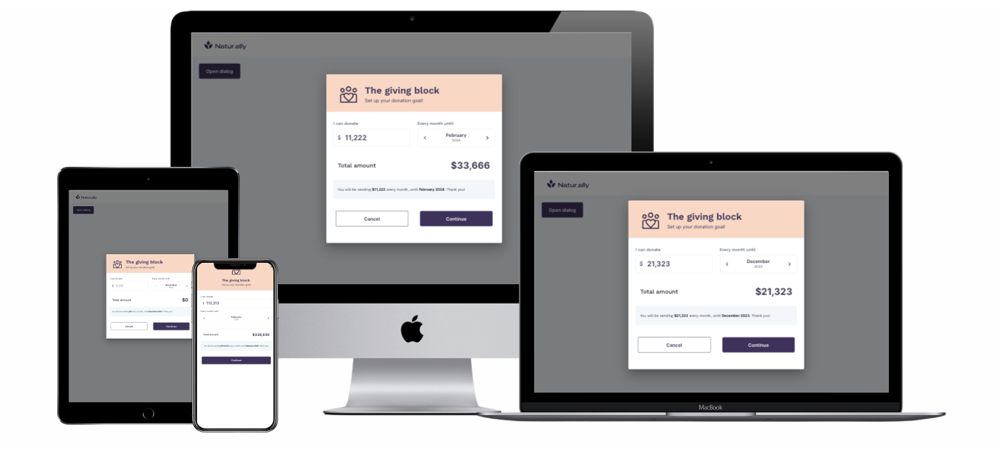

# Shift4 assigment

### Installation

- You should have at least **lts/hydrogen** node version installed to be sure that all packages will be installed correctly

### Usage

- `npm run dev`
- Visit [http://localhost:5173/](http://localhost:5173/) in your browser
- You can run storybook, with `npm run storybook` and visit [http://localhost:6006](http://localhost:6006)
   
   
   
  
